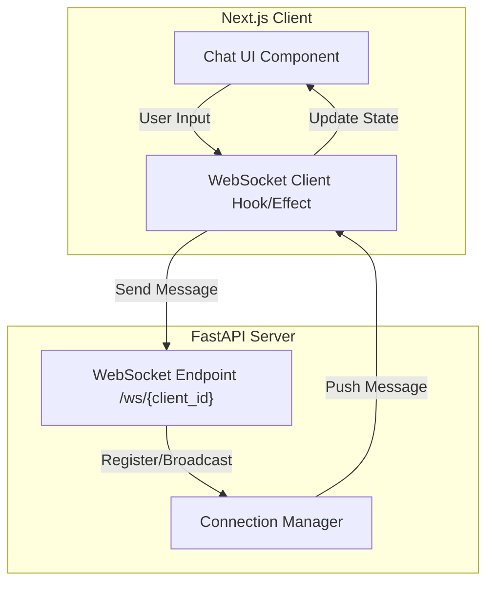

# Architecture Review: Simple Chatting System

This document provides an overview of the architecture for the real-time chatting system implemented with FastAPI (Backend) and Next.js (Frontend).

## Overview
The system uses a WebSocket-based communication model to facilitate real-time, bi-directional messaging between multiple clients.

## High-Level Architecture

## Component Details

### Backend (FastAPI)
- **FastAPI Framework**: Handles the web server and WebSocket routing.
- **Connection Manager**: A central class that tracks active `WebSocket` connections. It provides methods to connect, disconnect, and broadcast messages to all active participants.
- **WebSocket Endpoint**: Listens for connections at `/ws/{client_id}`. It receives messages from a specific client and uses the Connection Manager to broadcast them to everyone.

### Frontend (Next.js)
- **React Components**: A simple chat interface allowing users to enter their ID and send messages.
- **WebSocket Hook**: Manages the lifecycle of the WebSocket connection (connect, message receipt, close).
- **State Management**: Uses React's `useState` and `useEffect` to manage the message list and connection status.

## Data Flow
1. A user opens the application and connects to the backend WebSocket endpoint.
2. When a user sends a message, it is sent over the WebSocket as a JSON object or string.
3. The backend receives the message and immediately iterates through all active connections, sending the message to each one.
4. Each client receives the broadcasted message and updates their local state to display it in the UI.
